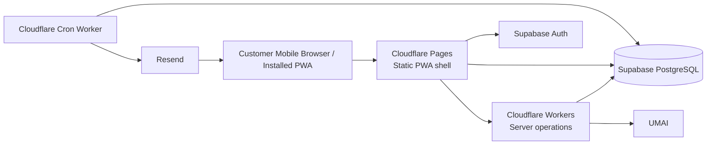
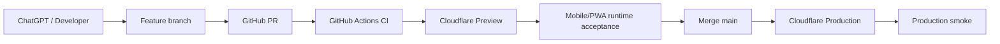

# Architecture & Stack

## Architecture posture

Rembayung Access is **mobile-first and PWA-first**. The primary customer runtime is a touch-first installable web application. Desktop support is progressive enhancement.

Core rules:

- Mobile viewport and touch ergonomics are the acceptance baseline.
- PWA installability is part of the product architecture, not a later cosmetic enhancement.
- The app shell may be cached for fast launch and resilience.
- Supabase remains authority for transactional state; offline/PWA caches never become booking, draw, interest or invitation authority.
- Any retryable write must remain explicit, idempotent and server-confirmed.
- The core journey must not depend on native Android/iOS binaries.

## Selected stack

| Layer | Choice | Reason |
|---|---|---|
| Web/PWA | Next.js 16 + React 19 + TypeScript | installable mobile-first customer surface |
| Cloud frontend | Cloudflare Pages | low-ops static/PWA delivery with global edge caching |
| Cloud runtime | Cloudflare Workers | server-side endpoints and background workloads where required |
| Database | Supabase PostgreSQL | canonical transactional state |
| Authentication | Supabase Auth | one-account registration/login |
| Scheduler | Cloudflare Cron Trigger | automatic batch release independent of browser/admin |
| Email | Resend | transactional invitation email |
| CSS | responsive CSS / Tailwind-compatible design system | touch-first responsive prototype |
| Package manager | pnpm/npm-compatible Node workflow | reproducible CI build |
| CI/CD | GitHub Actions -> Cloudflare | controlled golden-path delivery |

## PWA baseline

The customer application must include:

- web app manifest with product name, theme/background metadata and `display: standalone`
- installable app icons including maskable support where practical
- service worker with controlled version/update lifecycle
- cached static shell/assets for repeat launch
- safe fallback experience when the network is unavailable
- mobile safe-area support for installed/fullscreen contexts
- responsive layouts designed from narrow viewport upward
- minimum touch-target sizing and no hover-only critical controls
- runtime reconciliation after reconnect before showing transactional state as current

Offline scope is intentionally bounded. Authentication refresh, joining/cancelling interest, draw outcome, invitation validation and UMAI redirect require authoritative network/server confirmation.

## Runtime topology

## Responsibility split

### Cloudflare Pages / customer PWA
- mobile-first customer UI
- installable PWA shell
- authenticated read/write calls allowed by RLS/RPC boundaries
- local cache only for non-authoritative shell/assets
- reconnect/reconciliation UX

### Cloudflare web/worker runtime
- minimum admin UI/server endpoints where required
- invitation validation endpoints
- authenticated UMAI redirect
- server-only privileged operations

### Cloudflare broadcast worker
- runs on scheduler
- asks database for due waves
- invokes transactional draw RPC
- sends pending invitation emails through Resend
- records provider delivery result

### Supabase
- Auth
- canonical tables
- RLS
- unique constraints
- transactional random selection RPC
- auditable wave and invitation records

### Resend
- transactional email only
- no product-state authority

## Deployment topology

## Runtime acceptance baseline

Every customer-facing slice should be checked at minimum for:

- narrow mobile viewport rendering
- touch interaction without horizontal overflow
- authenticated refresh/reload behaviour
- installed PWA/standalone behaviour once PWA shell is active
- degraded/offline launch behaviour where applicable
- reconnect state reconciliation
- no local/offline claim of authoritative booking or invitation state

## Source of truth

`origin/main + Supabase migrations + canonical docs + verified runtime`
