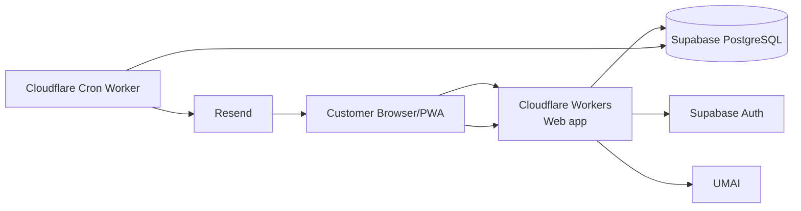
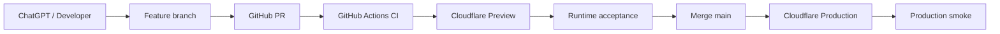

# Architecture & Stack

## Selected stack

| Layer | Choice | Reason |
|---|---|---|
| Web | Next.js 16 + React 19 + TypeScript | fast prototype UI/API |
| Cloud runtime | Cloudflare Workers | low-ops serverless runtime |
| Database | Supabase PostgreSQL | canonical transactional state |
| Authentication | Supabase Auth | one-account registration/login |
| Scheduler | Cloudflare Cron Trigger | automatic batch release independent of browser/admin |
| Email | Resend | transactional invitation email |
| CSS | Tailwind CSS | fast responsive prototype |
| Package manager | pnpm | workspace-friendly |
| CI/CD | GitHub Actions -> Cloudflare | controlled golden-path delivery |

## Runtime topology

## Responsibility split

### Cloudflare web
- customer UI
- minimum admin UI
- invitation validation endpoints
- authenticated UMAI redirect
- server-only privileged operations where required

### Cloudflare broadcast worker
- runs on scheduler
- asks database for due waves
- invokes transactional draw RPC
- sends pending invitation emails through Resend
- records provider delivery result

### Supabase
- Auth
- canonical tables
- RLS
- unique constraints
- transactional random selection RPC
- auditable wave and invitation records

### Resend
- transactional email only
- no product-state authority

## Deployment topology

## Source of truth

`origin/main + Supabase migrations + canonical docs + verified runtime`
