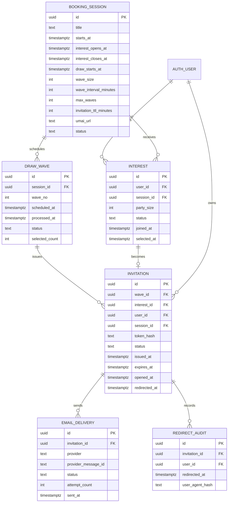

# ERD

```mermaid
erDiagram
    AUTH_USER ||--o{ INTEREST : joins
    BOOKING_SESSION ||--o{ INTEREST : receives
    BOOKING_SESSION ||--o{ DRAW_WAVE : schedules
    DRAW_WAVE ||--o{ INVITATION : issues
    INTEREST ||--o| INVITATION : becomes
    AUTH_USER ||--o{ INVITATION : owns
    INVITATION ||--o{ EMAIL_DELIVERY : sends
    INVITATION ||--o{ REDIRECT_AUDIT : records

    BOOKING_SESSION {
      uuid id PK
      text title
      timestamptz starts_at
      timestamptz interest_opens_at
      timestamptz interest_closes_at
      timestamptz draw_starts_at
      int wave_size
      int wave_interval_minutes
      int max_waves
      int invitation_ttl_minutes
      text umai_url
      text status
    }

    INTEREST {
      uuid id PK
      uuid user_id FK
      uuid session_id FK
      int party_size
      text status
      timestamptz joined_at
      timestamptz selected_at
    }

    DRAW_WAVE {
      uuid id PK
      uuid session_id FK
      int wave_no
      timestamptz scheduled_at
      timestamptz processed_at
      text status
      int selected_count
    }

    INVITATION {
      uuid id PK
      uuid wave_id FK
      uuid interest_id FK
      uuid user_id FK
      uuid session_id FK
      text token_hash
      text status
      timestamptz issued_at
      timestamptz expires_at
      timestamptz opened_at
      timestamptz redirected_at
    }

    EMAIL_DELIVERY {
      uuid id PK
      uuid invitation_id FK
      text provider
      text provider_message_id
      text status
      int attempt_count
      timestamptz sent_at
    }

    REDIRECT_AUDIT {
      uuid id PK
      uuid invitation_id FK
      uuid user_id FK
      timestamptz redirected_at
      text user_agent_hash
    }
```

`AUTH_USER` maps to `auth.users` in Supabase and is not recreated as a public identity table for the prototype.
