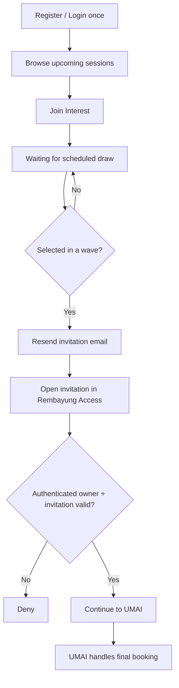
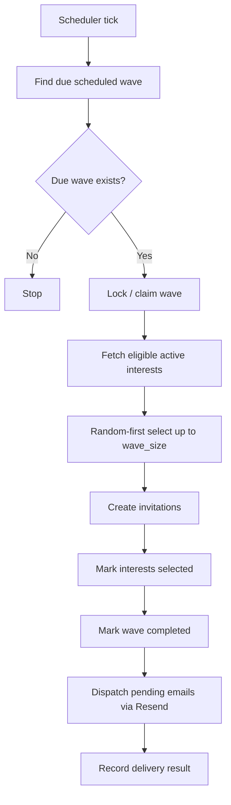
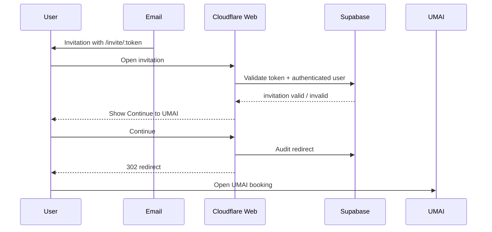

# Flowcharts & Sequence

## Customer flow



## Automatic batch broadcast



## Invitation access



## Wave example

```mermaid
timeline
    title Scheduled release example
    21:00 : Wave 1 auto-selects random eligible users
    21:10 : Wave 1 invitation TTL/reconciliation point
    21:12 : Wave 2 releases automatically
    21:22 : Wave 2 reconciliation point
    21:24 : Wave 3 releases automatically
    21:34 : Release window completes
```
